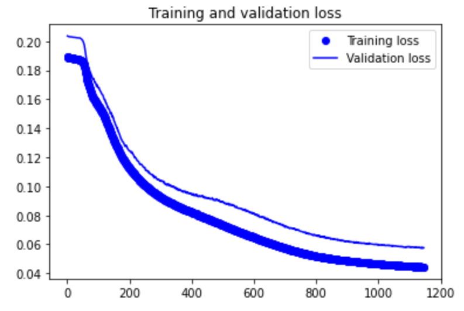
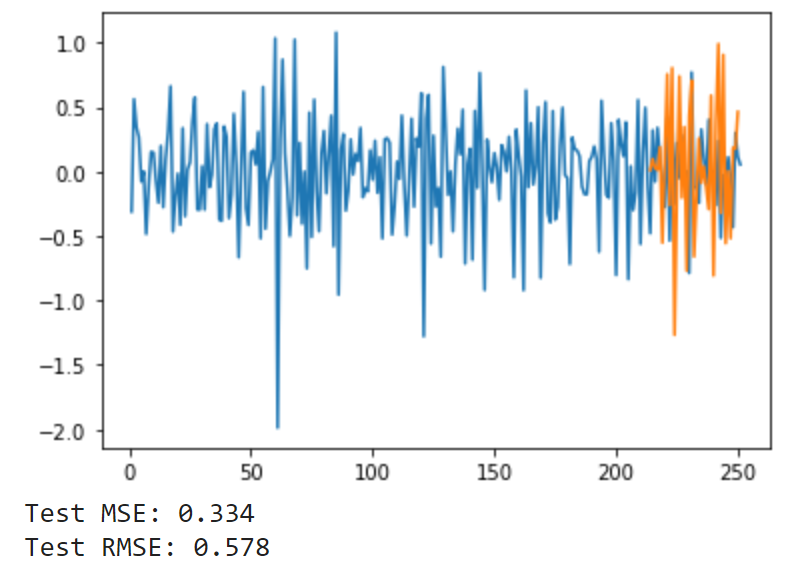
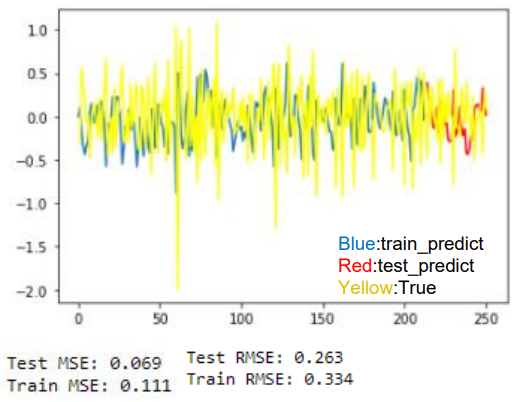

# watermelon_price_pridict
 It's the report of class that call "Agricultural products price".In this report ,I use stata and python to pridict price of watermelon.
 
 # result:
 LSTM loss curve:
  

LSTM predict:
  

ARIMA(one head/roll) predict:
 

